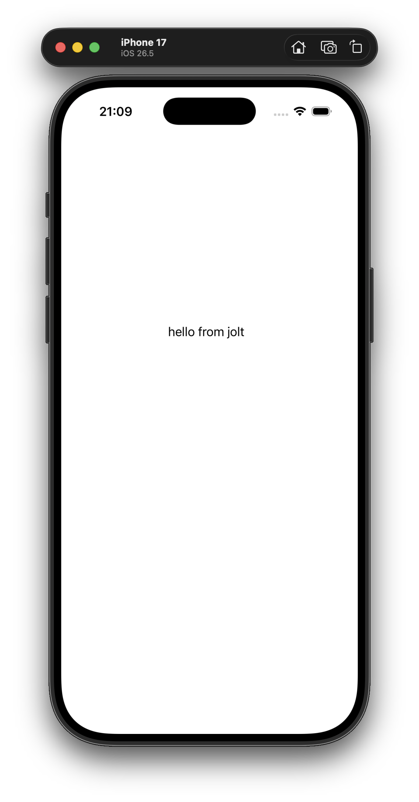
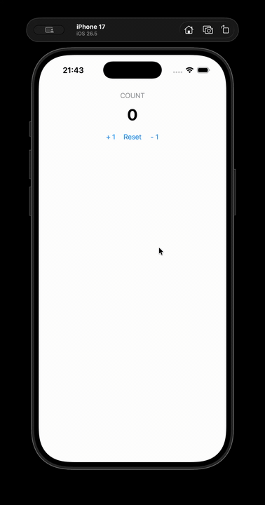

#+title: glimmer-ios-demo
#+author: Larry Staton
#+date: 30 August 2026

* Introduction

An virtual machine: run a [[https://github.com/burinc/glitter][glitter]] app on iOS, with a renderer over *UIKit* the way
[[https://github.com/burinc/glitter-uikit][glitter-uikit]] renders over AppKit — same reconciler, same hiccup, same
state-atom pattern, a new toolkit behind the seam. The goal of the first
milestone is deliberately small: the counter from
[[https://github.com/statonjr/glitter-uikit-demo][glitter-uikit-demo]], running in the iOS Simulator, with its state/view/actions
code *unchanged except the requires*.

Nobody in #jolt has tried iOS yet; Android has been demonstrated (differently
— see below). This notebook starts as the research that says the attempt is
worth making, and will accrete the experiment as it happens, in the same
literate style as the macOS demo: prose first, mistakes kept, code tangled
from this document once there is code to tangle.

* Research findings (2026-08-30)

** Chez officially targets iOS

Mainline Chez Scheme 10's [[https://github.com/cisco/ChezScheme/blob/main/BUILDING][BUILDING]] documents a =tarm64ios= machine type with
a cross-compile recipe:

#+begin_example
./configure \
  --cross \
  -m=tarm64ios \
  CFLAGS="-arch arm64 -isysroot $(xcrun -sdk iphoneos --show-sdk-path) -DTARGET_OS_IPHONE=1 -DDISABLE_CURSES" \
  LDFLAGS="-liconv" \
  CC_FOR_BUILD=clang
make
#+end_example

So the runtime jolt stands on already knows how to be an iOS binary. Chez
also has the =pb= (portable bytecode) backend — which turns out to be the
key to shipping (next section).

** The one architectural wall: W^X

This explains why Android already works and iOS is unproven. Chez's native
machine types load compiled boot images into /executable memory at runtime/.
Android permits that. iOS forbids runtime code creation for App Store apps —
no JIT entitlement. Three escape hatches, in increasing shippability:

1. *The Simulator* — JIT is allowed; everything behaves as on macOS. All
   development happens here.
2. *A dev-signed device with the debugger attached* — JIT is effectively
   available; fine for personal builds.
3. *The =pb= backend* — bytecode interpreted by the signed C kernel is
   /data/, not code, and therefore App Store-legal. This is exactly how
   Racket CS ships on iOS. Roughly 2–5× slower than native Chez; immaterial
   for a UI app. (App Store rule 2.5.2 permits interpreting code /bundled
   with/ the app; downloading new code is what's banned — so an on-device
   nREPL stays a dev-only feature.)

** The Android precedent — a different architecture

[[https://github.com/jasalt/jolt-android-experiment][jasalt/jolt-android-experiment]] (branch =master=) validates a lot: reproducible
cross-builds of Chez + a reduced jolt as an =arm64-v8a= shared library,
single-runtime-thread confinement, lifecycle survival, effects executed
through Android APIs, a bounded debug-eval path. Its README explicitly names
"a plausible shared-runtime path across Android and Apple platforms."

But its shape is *embedded-core*: jolt runs portable domain logic; the UI is
native Kotlin/Compose; events and effects cross a JNI boundary as data. That
is option A below — proven, and different from what this project attempts.

** Two architectures

A third arrived the same day, and supersedes both — see
[[*Option C — a backend, not a renderer port][Option C]].

- *Option A — embedded core* (the Android experiment's shape): jolt/Chez as a
  static library; a Swift/UIKit shell owns the UI; events in, effect data
  out, across a C boundary. Pros: Xcode owns packaging and signing; no ObjC
  runtime gymnastics; matches the proven Android path, so domain code shares
  across all platforms. Cons: the UI is not hiccup; you write Swift.
- *Option B — the renderer swap* (this project): port glitter-uikit's four
  namespaces to UIKit, so hiccup drives real =UIButton=​s. The audit below
  says most of it is mechanical.

** The renderer-port audit (option B)

Superseded the same day by [[*Option C — a backend, not a renderer port][Option C]], and kept: it is
still the best inventory of what the Objective-C layer has to do, and the wall
it missed is recorded in [[*The GTK4 wall the audit missed][the section that found it]].

Namespace by namespace, against glitter-uikit as it stands:

| namespace              | verdict                                                                    |
|------------------------+----------------------------------------------------------------------------|
| =ffi.clj=              | ~90% verbatim. Same ObjC runtime, same =objc_msgSend= arm64 ABI, same HFA struct-flattening rule, same CoreFoundation. Change the dlopen path to UIKit.framework and the enum constants. |
| =app.clj=              | The CFRunLoopSource scheduler ports *verbatim* (CoreFoundation is identical on iOS). The bootstrap changes: =UIApplicationMain(argc, argv, nil, "GlitterAppDelegate")= replaces =[NSApp run]= and never returns; the delegate class is built at runtime with =objc_allocateClassPair= + foreign-callable IMPs — exactly glitter-uikit's GlitterTarget pattern, plus =application:didFinishLaunchingWithOptions:= (create =UIWindow= + root view controller, call on-activate). Omitting the scene manifest from Info.plist keeps the legacy delegate lifecycle. |
| =widget.clj=           | =UIStackView= ≈ =NSStackView= (axis/spacing/distribution), so =:vbox=​/​=:hbox= port near-verbatim. =UILabel.attributedText= takes the existing markup pipeline. =UIButton= wires via =addTarget:action:forControlEvents:= — richer than NSControl's single action slot, and the pointer-keyed handler registry still fits. =UITextField= → editingChanged. |
| =appkit.clj= (renderer) | Mostly verbatim — it talks to the widget layer, not to AppKit. |

Design inversions to expect:

- No multi-window: the macOS demo's hub-opens-windows becomes a
  =UINavigationController= push — the "swap content in place" branch not
  taken on macOS is the iOS-correct one.
- UIKit's main-thread checker is stricter than AppKit's; the =on-gui=
  discipline glitter-uikit already enforces carries over unchanged.
- Bonus: a UIKit renderer gets *Mac Catalyst* nearly free — UIKit-on-Mac is
  Apple's own supported configuration.

** The real unknown: =jolt build= cross-targeting

jolt's build pipeline (emit Scheme → Chez =compile-file=​/​=make-boot-file= →
embed the boot as C bytes → cc-link against =libkernel.a=) is /shaped/ right
— the cc-link step is exactly where =-target arm64-apple-ios -isysroot ...=
goes, and the compile step is where =tarm64ios= (or =pb=) would be selected.
But nothing suggests =jolt build= exposes a cross-target flag today, and the
Android experiment drove Chez directly with a reduced jolt library — which
hints that it doesn't. *This is the question for Dmitri in #jolt.* Also
publicly untested: jolt on the =pb= backend at all (jolt requires a threaded
Chez; a threaded =pb= variant exists).

Answered the same evening, by =jolt --help= rather than by Dmitri — see
[[*The real unknown was in =jolt --help= (2026-08-30, later)][below]].

* The strategy changes: the reactive core came out (2026-08-30)

Dmitri, in #jolt, hours after the research above was written:

#+begin_quote
yup, I factored out the reactive core, so now it's trivial to hook into any
native lib that offers up C ABI
#+end_quote

Read against the audit, that sentence does three things: it removes a wall the
audit never saw, it demotes the port from a renderer swap to a /backend/, and —
followed one repository further — it turns out most of what the audit proposed
to write already exists.

** The GTK4 wall the audit missed

The audit went namespace by namespace through glitter-uikit and never opened
=deps.edn=. glitter-uikit's own says why that was a mistake:

#+begin_quote
KNOWN LIMITATION: glitter's own deps.edn declares GTK4/GLib/GObject/GIO under
=:jolt/native=, and jolt inherits a dependency's natives transitively and
hard-fails in =load-natives!= before any namespace loads when one is missing.
So GTK4 must be installed to run anything here, even though this renderer never
calls a GTK function. Verified live, including that an =:aliases=-scoped
=:jolt/native= is silently ignored, so there is no way to scope it away.
#+end_quote

The macOS notebook already records the consequence — its Dependencies section
tells you to =brew install gtk4= for an app that renders pure AppKit. On macOS
that is a wart. On iOS it is fatal: there is no GTK4 in an =.ipa=, the natives
load before any namespace is required, and no alias can scope them away.
Milestone 4 needs =glitter.core=, which needs the glitter dep, which needs four
dylibs that cannot exist on the device.

That same comment names the fix — "extracting a natives-free glitter-core the
way upstream glimmer did at v0.1.0" — which is exactly what Dmitri's message
announces, one project over.

** glimmer v0.1.0: the core came out clean

=jolt-lang/glimmer= at v0.1.0 (=5581c331=), the whole of its =deps.edn=:

#+begin_src clojure :tangle no
{:paths ["src"]
 ;; No dependencies, native or otherwise: glimmer is the portable half of the
 ;; toolkit — reactive cells, the component model and the reconciler.
 :deps {}
 :aliases {:test {:extra-paths ["test"] :main-opts ["-m" "glimmer.test-runner"]}}}
#+end_src

Three namespaces, 803 lines: =glimmer.ratom= (reactive cells with automatic
dependency tracking), =glimmer.backend= (the seam), =glimmer.core= (component
model, positional and keyed reconciliation, mount/unmount). The whole suite runs
headless against an in-memory mock backend. The wall is gone, not climbed.

** The seam is nine functions

A backend is a plain map, five keys required:

#+begin_src clojure :tangle no
{:name           :uikit
 :create!        (fn [tag props] widget)      ; construct, apply props, wire events
 :apply-props!   (fn [tag widget props])      ; re-apply on re-render
 :append-child!  (fn [parent-tag parent child])
 :remove-child!  (fn [parent-tag parent child])
 :replace-child! (fn [parent-tag parent old new])
 ;; optional
 :reorder-child! (fn [parent-tag parent child sibling])
 :schedule       (fn [work])                  ; run a thunk on the UI thread
 :run            (fn [opts mount-root!])      ; the event loop
 :text->element  (fn [s] hiccup)}             ; default [:label {:label s}]
#+end_src

A widget is whatever the backend says it is — a pointer, a record, a map; the
core never inspects one, it only hands it back. Two of the optional keys are
shaped for precisely the problems the audit flagged:

- =:schedule=, paired with =glimmer.backend/loop-running?=, /is/ the =on-gui=
  discipline, already factored out as a backend concern rather than something a
  renderer must re-invent.
- =:run= takes =(fn [opts mount-root!])=, and its contract is: create a
  top-level container, call =(mount-root! container tag)=, then run the event
  loop, blocking. glimmer-gtk calls =mount-root!= from inside its =activate=
  foreign-callable — /within/ the running loop.

That second one matters more than it looks. glitter-uikit's =app.clj= carries a
long CORRECTION (P4.T4, 2026-08-20) about AppKit calling =on-activate= eagerly,
before the loop starts, unlike glitter.gtk's signal-driven one. iOS is the GTK
shape, not the AppKit shape: =application:didFinishLaunchingWithOptions:= fires
from inside =UIApplicationMain=. Under glimmer that is not an inversion to port
around — it is what the contract already expects. =mount-root!= even takes a tag
alongside the container, so nothing in the core assumes a window.

** Option C — a backend, not a renderer port

So "Two architectures" needs a third entry, and the third one wins:

- *Option C — the glimmer backend* (what this project will now do): implement
  =glimmer.backend='s nine functions over UIKit. glimmer owns reactivity, the
  component model and reconciliation, and declares no natives; this project owns
  widgets, prop/event wiring, and the app loop. Pros: the GTK4 wall does not
  exist, the loop contract is already iOS-shaped, and the seam is nine functions
  rather than four namespaces. Cons: the demo's Replicant-style state atom
  becomes a reagent-style ratom — see below.

** The better ancestor: jolt-lang/glimmer-uikit

Following the lineage one step further turns up =jolt-lang/glimmer-uikit=: the
AppKit backend for glimmer, pinned to the same v0.1.0 sha, 1,157 lines, with
this in its =deps.edn=:

#+begin_quote
AppKit itself is NOT declared under =:jolt/native= — glimmer-uikit.ffi loads the
frameworks itself, guarded to macOS only. That keeps =jolt -M:test= (the
headless markup/string tests) runnable on Linux CI, where no AppKit exists.
#+end_quote

This is the ancestor of everything the audit examined. glitter-uikit's =app.clj=
says it was "adapted from the non-reconciler half of glimmer-uikit.core (its
scheduler, run*, run! and quit!)", and =GlitterTarget= is a rename of
=GlimmerTarget=. The audit, in other words, spent its time on the /downstream/
fork — the one carrying a reconciler that drags GTK — when the upstream one was
the thing to fork: same Objective-C, same fixed-arity =objc_msgSend= bindings,
same CoreFoundation scheduler, same Pango-subset-to-=NSAttributedString= markup
pipeline, and no natives at all.

Its own namespace docstring settles a naming question the audit left open:

#+begin_quote
The AppKit backend for glimmer (the macOS native toolkit — 'uikit' names this
project, not the iOS framework).
#+end_quote

So the actual-UIKit backend cannot be called glimmer-uikit. Working name:
*glimmer-ios*.

** Two corrections to carry forward

glitter-uikit is the later fork, and burinc fixed two things there that
glimmer-uikit's =core.clj= still has. Both must come along.

*The scheduler drain is not atomic.* glimmer-uikit's perform callback:

#+begin_src clojure :tangle no
(let [jobs @queue]
  (reset! queue [])
  ...)
#+end_src

A worker thread's =(swap! queue conj work)= landing between the deref and the
reset is captured by neither the already-read =jobs= nor the just-clobbered
queue: the thunk is lost permanently, with no error and no log line.
glitter-uikit's CORRECTION (P3.T2, 2026-08-20) replaced it with =swap-vals!=,
which is CAS-based — a concurrent post either drains now or survives for the
next signal.

*=loop-running?= is set after the mount.* glimmer-uikit's =run*= calls
=(mount-root! win :window)= and only afterwards =(reset! b/loop-running? true)=,
so for the whole of the mount the flag is false and every off-thread ratom write
renders inline, on the wrong thread. Same bug as glitter-uikit's P4.T4
correction, which a main-thread smoke found there.

The second one fixes itself here: once =mount-root!= moves inside
=didFinishLaunchingWithOptions:=, the flag is necessarily set before
=UIApplicationMain= — which is glimmer-gtk's ordering. Both deserve a PR
upstream regardless of what this project does.

The synthesis, then: the seam and the loop ordering from *glimmer-gtk*,
everything Objective-C from *glimmer-uikit*, the two corrections from
*glitter-uikit*.

** What it costs: the counter is no longer unchanged

The introduction's promise — the counter running "with its state/view/actions
code unchanged except the requires" — does not survive the substrate change.
glimmer is reagent-shaped: form-2 components, component-local ratoms,
=:on-click= taking a closure. The demo is Replicant-shaped: one state atom,
=[[:action/inc]]= vectors, =s/multi-spec= validation, =demo.registry='s
multimethod pair.

The damage is smaller than that sounds. glimmer-uikit's widget layer already
supports =:spacing=, =:homogeneous=, =:margin= (mapped to the stack's edge
insets) and =:markup= over the same Pango vocabulary, so the counter's view
survives character for character:

#+begin_src clojure :tangle no
[:label {:markup [:span {:size "xx-large" :weight "bold"} (str count)]}]
#+end_src

And =:on-click= takes an arbitrary closure, so actions-as-data survives with its
specs and multimethods intact:

#+begin_src clojure :tangle no
[:button {:label "+ 1" :on-click #(reg/execute-actions nil [[:action/inc]])}]
#+end_src

What changes is one line per button, and the state atom becoming a ratom. So
milestone 4's claim narrows, honestly, to: /the counter's view unchanged, its
dispatch rewired one line per button/. That is a diff worth printing, and a
better demonstration than an assertion of sameness.

** What has not changed

=jolt build= cross-targeting is still the open question, and nothing above
touches it. Dmitri's message is about the backend seam, not about =tarm64ios=,
=pb=, or W^X. The Android experiment's workaround — drive Chez directly with a
reduced jolt library — remains the fallback, and proving it works is independent
of the answer. It becomes milestone 0.

(Hours later, it was answered — see
[[*The real unknown was in =jolt --help= (2026-08-30, later)][the next section]].)

** The real unknown was in =jolt --help= (2026-08-30, later)

The question marked for Dmitri above — does =jolt build= cross-target? — had
its answer installed on this machine the whole time:

#+begin_example
$ jolt --version
jolt v0.7.29
$ jolt --help | grep -A3 'build -m'
  build -m NS [-o OUT] [--opt|--dev] [--direct-link] [--tree-shake] [--dynamic]
              [--library] [--target MACHINE --target-pack DIR]
                         ... --target cross-compiles either one for another
                         Chez machine (see tools/cross-compile)
#+end_example

=tools/cross-compile/README.md= in the jolt repo is the answer to
[[https://github.com/jolt-lang/jolt/issues/375][jolt#375]], and its first line is "yes — jolt cross-compiles." The mechanism
is exactly the one the audit guessed at: steps 1–3 of =jolt build= emit
machine-neutral Scheme text; step 4 (=compile-file= → =make-boot-file= → cc
link) runs under Chez's own cross =xpatch=, which =make bootquick XM=<target>=
produces alongside the target's boot files. A *target pack* is a directory
holding the target's =petite.boot=, =scheme.boot=, =libkernel.a=, =scheme.h=,
the =xpatch=, a =link-libs= file of =-l=​/​=-framework= flags, and static lz4/zlib
under =lib/=; =make-pack.sh= assembles one from a prepared Chez checkout.
=JOLT_TARGET_CC= and =JOLT_TARGET_ARCH_FLAG= pick the target compiler and its
flags; =JOLT_TARGET_LINK_LIBS= overrides the pack's =link-libs= wholesale.

Proven so far: macOS arm64 → x86_64, Linux x86_64 ↔ aarch64, and cross-OS
macOS → Linux via =zig cc=. Not iOS — the README never mentions it — but
nothing in the mechanism is macOS-specific, and =make-pack.sh= accepts any
machine string. Three iOS-specific wrinkles, all visible from the scripts:

- =make-pack.sh='s =link-libs= =case= matches =*osx=, =*le=, =*nt= and falls
  through to =-llz4 -lz -lm= for anything else — so =tarm64ios= gets a link
  line with no =Foundation= and no =iconv=. =JOLT_TARGET_LINK_LIBS= is the
  override; the right string is roughly
  =-llz4 -lz -framework Foundation -liconv -lm= (no ncurses — the kernel is
  built =-DDISABLE_CURSES=).
- lz4 is not in the iOS SDK (libz is). Chez's in-tree lz4 has to be built for
  the target, which the cross configure does; the pack's =lib/liblz4.a= then
  carries it.
- Chez pins: jolt's CI builds against *Chez v10.4.1*, and a pack's xpatch,
  boots and kernel must all come from that one tree. Mainline's BUILDING
  recipe for =tarm64ios= is present at that tag.

And the simulator recipe the milestone list already asked for, now concrete
— the BUILDING recipe with the SDK and target swapped:

#+begin_example
git clone --depth 1 --branch v10.4.1 --recurse-submodules https://github.com/cisco/ChezScheme ~/dev/ChezScheme
cd ~/dev/ChezScheme
./configure -m=tarm64osx --installprefix=/opt/chez && make && sudo make install   # host compiler (~6 min)
make bootquick XM=tarm64ios                            # boots + xpatch  (~2 min)
SDK=$(xcrun -sdk iphonesimulator --show-sdk-path)
./configure --cross --force -m=tarm64ios --disable-curses --disable-x11 \
  CFLAGS="-target arm64-apple-ios-simulator -isysroot $SDK -DTARGET_OS_IPHONE=1 -DDISABLE_CURSES" \
  LDFLAGS="-liconv" CC_FOR_BUILD=clang
make                                                   # target kernel   (~1 min)
CHEZ_SRC=~/dev/ChezScheme tools/cross-compile/make-pack.sh tarm64ios /tmp/pack-tarm64ios-sim

JOLT_CHEZ=/opt/chez/bin/chez \
JOLT_TARGET_CC=clang \
JOLT_TARGET_ARCH_FLAG="-target arm64-apple-ios-simulator -isysroot $SDK" \
JOLT_TARGET_LINK_LIBS="-L/tmp/pack-tarm64ios-sim/lib -llz4 -lz -framework Foundation -liconv -lm" \
  jolt build -m hello.core -o Hello.app/Hello --target tarm64ios --target-pack /tmp/pack-tarm64ios-sim
#+end_example

One detail the scripts make explicit: a cross build always /spawns/ a host
Chez to run the xpatch'd =compile-file= (the self-contained in-process
compiler cannot load one). =build.ss= finds it through =$JOLT_CHEZ=, falling
back to =chez=, =scheme= or =petite= on =PATH= — and the Homebrew jolt ships
none of those, which is why the host build above is installed and named.

Untested as written — that is milestone 1. But the shape is no longer a
research question; it is a script waiting for an SDK.

*** The actual blocker: no Xcode

#+begin_example
$ xcodebuild -version
xcode-select: error: tool 'xcodebuild' requires Xcode, but active developer
directory '/Library/Developer/CommandLineTools' is a command line tools instance
$ xcrun -sdk iphonesimulator --show-sdk-path
xcrun: error: SDK "iphonesimulator" cannot be located
$ xcrun simctl list devices available | grep iPhone
(nothing)
#+end_example

Everything above this line was researched on a machine with Command Line
Tools only. No iOS SDK, no simulator runtime, no =simctl= devices. Milestone
1 cannot start — cannot even configure Chez's kernel — until Xcode proper is
installed and =xcode-select= pointed at it. That is the next step, and it is
a download, not a design decision.

*** Unblocked — and the host Chez is a formula (2026-08-30, later still)

Xcode 26.6 landed. The three commands above now answer:

#+begin_example
$ xcode-select -p
/Applications/Xcode.app/Contents/Developer
$ xcodebuild -version
Xcode 26.6
Build version 17F113
$ xcrun -sdk iphonesimulator --show-sdk-path
.../Platforms/iPhoneSimulator.platform/Developer/SDKs/iPhoneSimulator26.5.sdk
$ xcrun simctl list devices available | grep iPhone
    iPhone 17 Pro (D3278E8B-…) (Shutdown)
    iPhone 17 (3E4417C0-…) (Shutdown)
    …
#+end_example

(Two notes while checking. The installed jolt was v0.7.28 when this section
was written — a step behind the v0.7.29 quoted above, which the tap already
had; =brew upgrade= closed the gap, and =build --target= is in both. And the
recipe's =cross-compile= tools live in the jolt /repository/, not in the
Homebrew binary; they need a checkout.)

The recipe's first line — six minutes building a host Chez into =/opt/chez=
and naming it through =JOLT_CHEZ= — turns out to be unnecessary. Homebrew's
=chezscheme= formula is *10.4.1*, exactly the tag jolt's CI pins, configured
=--threads= (jolt requires a threaded Chez) and =--installschemename=chez= —
so the binary lands on =PATH= as =chez=, the first name =build.ss= probes.
The host compiler is therefore a Brewfile line, tangled from this document
the way the macOS demo's is, and installed with =brew bundle --file=./Brewfile=
(explicit on purpose: anyone with =HOMEBREW_BUNDLE_FILE= pointing at a global
Brewfile would otherwise install that one instead):

#+begin_src ruby :tangle Brewfile :comments link
tap  "jolt-lang/jolt"
brew "jolt-lang/jolt/jolt"   # the jolt runtime/compiler; build --target since 0.7.28
brew "chezscheme"            # host Chez 10.4.1, threaded, on PATH as `chez` — what a cross build spawns
tap  "d12frosted/emacs-plus"
cask "emacs-plus-app"        # tangles this document (the macOS demo says brew "emacs"; this machine runs Emacs+)
mas  "Xcode", id: 497799835  # the iOS SDK, simulator runtimes and simctl; then xcode-select -s
brew "xcodegen"             # a throwaway Xcode project, so Xcode mints the signing cert + profile (milestone 5)
brew "libimobiledevice"     # iproxy: a TCP port on the phone, over USB, for nREPL (TODO 4)
brew "rlwrap"               # arrows + history for `jolt connect` (clj needs it too)
brew "librsvg"              # rsvg-convert: the app icon from media/jolt.svg
brew "imagemagick"          # crop, flatten and resize it
#+end_src

The =.gitignore= tangles from here too — it is toolchain residue, and the
first hand-edit to it (a =printf >>= onto a file with no trailing newline)
glued =Brewfile.lock.json= onto the =.lsp= line and un-ignored the directory.
Generated files do not get that kind of edit:

#+begin_src conf :tangle .gitignore :comments link
.DS_Store
.jolt
.lsp
.vscode
Brewfile.lock.json
Hello.app
# clj -Sdeps cache from `jolt connect-clj`, and rlwrap's history for `jolt connect`
.cpcache
.nrepl-history
.nrepl-port
# raw screen recordings; `jolt media` derives the committed mp4/gif from them
media/*.mov
# everything `jolt tangle` writes, this file included — git tracks the notebooks and media/
.gitignore
Brewfile
deps.edn
.clj-kondo/
src/
test/
scripts/
signing/
patches/
#+end_src

And the tangle itself is a =jolt= task, borrowed from the macOS demo, so the
whole regeneration is =jolt tangle=. The =deps.edn= is otherwise empty until
milestone 0 forks glimmer-uikit into it. One addition, learned the hard way
while tangling =.gitignore=: =:comments link= runs =comment-region= in the
block's major mode, and a language with no mode (there is no =gitignore-mode=;
the block above says =conf=, whose comment is =#=) leaves Emacs waiting on a
"No comment syntax is defined" minibuffer prompt that never returns in batch.
=</dev/null= turns that hang into an error. The Clojure blocks below need
=clojure-mode= for the same reason — =M-x package-install RET clojure-mode=
once, from any Emacs.

#+begin_src clojure :tangle deps.edn :comments link
{:paths ["src"]
 ;; Milestone 4: glimmer (the reactive core, no natives), hiccup (markup
 ;; serialization), spec (the registry) — pins match glimmer-uikit's. No
 ;; :jolt/native: UIKit is loaded from -main (see glimmer-ios/ffi.org).
 :deps {jolt-lang/glimmer {:git/url "https://github.com/jolt-lang/glimmer"
                           :git/tag "v0.1.0"
                           :git/sha "5581c331c51aff989259b9e8e92ec920fe5e6741"}
        weavejester/hiccup {:git/url "https://github.com/weavejester/hiccup"
                            :git/sha "b6b12097ba973141fe87c1b4d6a27ddcce5d5929"}
        ;; terminal under jolt (org.clojure/clojure contributes no children)
        org.clojure/spec.alpha {:mvn/version "0.5.238"}
        ;; TODO 3 wire: async fetch via NSURLSession (core.async go blocks)
        org.clojure/core.async {:mvn/version "1.6.673"}}
 :aliases {:test {:extra-paths ["test"] :main-opts ["-m" "glimmer-ios.test-runner"]}}

 ;; README.org is the source of truth; `jolt tangle` regenerates this file,
 ;; Brewfile and .gitignore from it. Never edit the tangled files directly.
 :tasks {;; every notebook, not just this one; never the deps checkout, the bundle, or docs/
         tangle "find . -name '*.org' -not -path './.jolt/*' -not -path './Hello.app/*' -not -path './docs/*' | xargs -I{} emacs --batch -l package --eval '(package-initialize)' -l org {} -f org-babel-tangle"   ; no </dev/null here: xargs reads the file list from stdin
         test   "jolt -M:test"
         ;; Milestone 1: cross-compile hello.core (or NS=screen.core) into the simulator bundle
         ;; (Info.plist is tangled), install it on the booted device, run it
         ;; with stdout attached. The pack is ~/dev/pack-tarm64ios-sim.
         bundle  "sh scripts/bundle"     ; NS=<ns> TARGET=sim|device — see Milestone 5
         install "xcrun simctl install booted Hello.app"
         ;; the phone: sign with the minted identity + profile, install, launch with the console attached
         device  "sh scripts/device"
         ;; the live counter (demo.repl, nREPL on its loopback 7888) for TARGET=sim|device;
         ;; then `jolt proxy` in another terminal for the phone, and connect to localhost:7889
         live    "sh scripts/live"
         proxy   "iproxy -u ${DEVICE:?set DEVICE to the phone UDID} 7889:7888"
         ;; a terminal REPL into a running app: nREPL's own client (jolt ships only the
         ;; server). Defaults to USB via `jolt proxy`; HOST=<phone ip> PORT=7888 for Wi-Fi.
         connect "rlwrap -H .nrepl-history bb scripts/nrepl-repl"   ; 0.1 s to a prompt; HOST/PORT as above
         ;; iOS suspends a backgrounded app; a plain launch RESUMES it (state kept, foreground
         ;; and active fire) so `jolt connect` answers again. Not --terminate-existing: that kills it.
         wake    "xcrun devicectl device process launch --device ${DEVICE:?set DEVICE to the phone UDID} dev.statonsoftware.glimmer-ios.hello"
         ;; what TARGET=sim and TARGET=device would talk to: booted simulators, paired phones
         devices "echo '# simulators (booted)'; xcrun simctl list devices booted | grep -E 'Booted'; echo '# devices (paired; export DEVICE=<udid>)'; xcrun devicectl list devices 2>/dev/null | tail -n +3"
         ;; nREPL's own JVM client, for comparison or when a fuller client is wanted (1.4 s+)
         connect-clj "clj -Sdeps '{:deps {nrepl/nrepl {:mvn/version \"1.3.1\"}}}' -M -m nrepl.cmdline --connect --host ${HOST:-127.0.0.1} --port ${PORT:-7889}"
         ;; not `run`: that is a jolt subcommand, and it wins over a task of the same name.
         ;; Plain launch: --console terminates the app when its session ends (milestone 3).
         launch  "xcrun simctl launch booted dev.statonsoftware.glimmer-ios.hello"
         ;; stdout of a running app, for as long as you keep the console open
         console "xcrun simctl launch --console booted dev.statonsoftware.glimmer-ios.hello"
         ;; media/counter.mov (a macOS screen recording of the simulator) → the two
         ;; shareable forms: H.264 mp4 for Slack/the web (faststart, 30 fps, 1080 tall),
         ;; and a palette GIF for the README (GitHub inline-plays GIFs, not video files).
         media   "ffmpeg -v error -y -i media/counter.mov -vf 'fps=30,scale=-2:1080' -c:v libx264 -profile:v high -pix_fmt yuv420p -crf 23 -preset slow -movflags +faststart -an media/counter.mp4 && ffmpeg -v error -y -i media/counter.mov -vf 'fps=12,scale=-2:720:flags=lanczos,split[a][b];[a]palettegen=max_colors=128[p];[b][p]paletteuse=dither=bayer:bayer_scale=5' media/counter.gif"
         ;; TODO 3 wire: serve app.edn from a local HTTP server for testing
         serve   "bb scripts/serve-app ${PORT:-8888}"}}
#+end_src

What Homebrew does /not/ replace is the =~/dev/ChezScheme= checkout: =make
bootquick XM=tarm64ios= and the =--cross= configure still need a source tree
at v10.4.1, and the pack's xpatch, boots and kernel come from it. Same
version on both sides is the whole reason the formula is acceptable as the
host — an xpatch is compiled Scheme, and it loads into the Chez that spawned
it only if the versions agree. So the recipe loses its first line and its
=JOLT_CHEZ=, and keeps everything from =make bootquick= on.

* Milestones

Written for option B, and kept: the shape of the climb barely changes, and
the two places it was wrong — packaging last, and "code unchanged" — are
worth being able to see. Superseded by the revised list below.

1. *Simulator hello-world*: Chez kernel built for the simulator SDK
   (=arm64-apple-ios-simulator=), a C =main= + =Sscheme_init= + embedded boot,
   jolt =-main= prints from inside a simulator =.app=.
2. *ObjC FFI proof*: =objc_getClass("UILabel")= round-trips in the simulator.
3. *Bootstrap port*: runtime-built app delegate + =UIApplicationMain= + the
   verbatim CFRunLoopSource scheduler → an empty =UIWindow= appears.
4. *Minimal widget set*: =:vbox= =:hbox= =:label= =:button= + the renderer →
   *the counter, on the simulator, its code unchanged*. ← the demo
5. *Device*: dev-signed build first (debugger JIT), then the =pb= backend for
   distribution; measure whether the interpreter cost is noticeable.
6. *Packaging*: Info.plist + provisioning + =codesign= — the macOS demo
   already rehearsed tangling a =.app= bundle from the notebook; iOS adds
   signing on top.

** Revised, after the strategy change (2026-08-30)

The list above assumed option B, and put packaging last. Both are wrong. A
simulator =.app= needs an =Info.plist=, =UIDeviceFamily=, =MinimumOSVersion= and
=xcrun simctl install= before milestone 1's =-main= can print anything, so only
provisioning and =codesign= genuinely belong at the end — and given the -10669
saga the macOS notebook records, this project of all projects should treat
bundle shape as load-bearing from the first launch.

0. *Fork =glimmer-uikit=*, drop the stale =src/glimmer_gtk/= tree it inherited
   from its own fork, and get =jolt test= green — the headless suite proves the
   core needs no toolkit. In parallel, and independent of everything else: put
   =jolt build= cross-targeting to Dmitri, and reproduce the Android
   experiment's build shape as the fallback if the answer is no.
   (The answer is yes — =jolt build --target= — so the fallback is moot; what
   milestone 0 now needs is Xcode.)
1. *Simulator hello-world, packaged*: Chez for =arm64-apple-ios-simulator=. Note
   that the BUILDING recipe quoted above is the /device/ one — the simulator
   wants =-isysroot $(xcrun -sdk iphonesimulator --show-sdk-path)= and
   =-target arm64-apple-ios-simulator=; there is no separate machine type, and
   =TARGET_OS_SIMULATOR= is what distinguishes them. Plus a minimal
   =Info.plist= tangled from this document, =simctl install=, =-main= prints.
2. *FFI proof*: =objc_getClass("UILabel")= round-trips. The change is the
   /guard/, not the dlopen path: =glimmer-uikit.ffi= gates the load on
   =os.name= being "Mac OS X", and its failure mode is a =println= followed by
   every class lookup silently returning null.
3. *=:run= and =:schedule=*: =UIApplicationMain= with a delegate class built at
   runtime, the CFRunLoopSource scheduler ported verbatim /with/ the
   =swap-vals!= fix, and =mount-root!= called from
   =didFinishLaunchingWithOptions:= → an empty =UIWindow= with a root view
   controller. One shape change to expect: =UIApplicationMain= takes a delegate
   /class name/ and instantiates the delegate itself, so the delegate cannot be
   the shared target instance the way =setDelegate:= allows on macOS — the
   =mount-root!= closure has to reach the callback through a global.
4. *The other seven keys*, for =:vbox= =:hbox= =:label= =:button= → *the
   counter, on the simulator*. Two silent no-ops to expect: the markup pipeline
   builds =NSFont= and =NSColor= objects, neither of which exists on iOS (and
   messaging nil returns nil, so the label renders unstyled instead of
   crashing), and =UIStackView= ignores =layoutMargins= unless
   =isLayoutMarginsRelativeArrangement= is YES, so =:margin= does nothing at
   all.
5. *Device*: dev-signed build first (debugger JIT), then =pb= for distribution.
6. *Distribution*: provisioning and =codesign=, on top of the bundle milestone 1
   already built.

Open, and inherited: every backend in this lineage tests through
=:auto-quit-ms=, which =quit!= implements with =stop-app!= — and an iOS app
neither quits nor may call =exit()=. glimmer's headless mock backend already
covers the reconciler, so what needs a substitute is the widget-level smokes;
=simctl= screenshots are the obvious candidate.

* Milestone 1: the simulator kernel (2026-08-31)

Two clones, both where the recipe said: ChezScheme at =v10.4.1= (with the
=zlib= and =zuo= submodules) into =~/dev/ChezScheme=, and the jolt repository
into =~/dev/jolt= beside it, for =tools/cross-compile/make-pack.sh= — the
Homebrew binary does not carry it.

** The recipe's first line, correctly deleted this time

Yesterday's claim that Homebrew's =chez= lets the recipe "lose its first
line" was half right. =make bootquick= does need an in-tree host build —
BUILDING says it "assumes that up-to-date boot files are in place for the
current machine type". But the =zuo= target behind it takes two flags the
Makefile never passes: =--host-scheme <command>=, which compiles the cross
compiler with an /installed/ Scheme instead, and =--xpatch=, which is the
only thing that makes it leave =xc-<target>/s/xpatch= behind
(=makefiles/boot.zuo=, line 47 — without the flag there is no xpatch, and
=re.boot= refuses it outright: "cannot generate xpatch in reboot mode").

So the order of operations inverts: the =--cross= configure comes /first/,
because it is what builds =bin/zuo= and lays out the workarea, and the boot
files come second, from Homebrew's =chez=:

#+begin_example
cd ~/dev/ChezScheme
SDK=$(xcrun -sdk iphonesimulator --show-sdk-path)
git apply ~/code/personal/glimmer-ios-demo/patches/chez-simulator-jit.patch   # tangled from this notebook; see "The simulator kernel's collector"
./configure --cross --force -m=tarm64ios --disable-curses --disable-x11 \
  CFLAGS="-target arm64-apple-ios-simulator -isysroot $SDK -DTARGET_OS_IPHONE=1 -DDISABLE_CURSES" \
  LDFLAGS="-liconv" CC_FOR_BUILD=clang
# → "Configuring for tarm64ios despite missing boot files"   (that is --force)
make bin/zuo
bin/zuo tarm64ios bootquick --xpatch --host-scheme /opt/homebrew/bin/chez tarm64ios
# → "building boot files for tarm64ios using tarm64osx" … 10 seconds …
#   boot/tarm64ios/{petite.boot,scheme.boot,scheme.h,equates.h,gc-*.inc}
#   xc-tarm64ios/s/xpatch                                     (2.0 MB)
make                                                        # target kernel
#+end_example

One mistake kept: the first attempt put =--host-scheme= /after/ the machine
name and got =expected optional <machine>: (list "tarm64ios" "--host-scheme"
…)=. =parse-boot-args= strips =--xpatch=, then looks for =--host-scheme= at
the head of what remains, and only then treats the leftover as the machine.
Flags first, machine last.

Ten seconds, from the compiler in the Brewfile. The host-build step the
recipe budgeted six minutes for is gone, and nothing in the tree was built
for the host at all — =bin/zuo= is the only host binary, and it is a C file.

** The kernel, in nine seconds

=make= in the cross-configured tree: =libkernel.a= (1.5 MB), static =liblz4.a=
and =libz.a= built for the target, and — a bonus the recipe never asked for —
a whole =tarm64ios/bin/tarm64ios/scheme= linked against the simulator SDK.
The objects are what they should be:

#+begin_example
$ ar x tarm64ios/boot/tarm64ios/libkernel.a alloc.o && otool -l alloc.o | grep -A4 LC_BUILD_VERSION
      cmd LC_BUILD_VERSION
 platform 7          ← iOS Simulator
    minos 14.0
      sdk 26.5
#+end_example

One warning, thirty times: ='DISABLE_CURSES' macro redefined=.
=--disable-curses= already writes the define into =config.h=, so the copy in
=CFLAGS= (inherited from mainline's device recipe) is redundant. Harmless;
dropped from the recipe above the next time it is retyped.

** A hello to cross-compile

Milestone 1's payload is deliberately nothing: a namespace with a =-main=
that prints. =os.name= is the interesting word — the cross-compile README
promises it is a runtime call, not a host string baked in at build time, so
whatever it prints from inside the simulator is the truth about where it ran.

#+begin_src clojure :tangle src/hello/core.clj :mkdirp true :comments link
(ns hello.core)

(defn -main [& _]
  (println "hello from" (System/getProperty "os.name")
           "on" (System/getProperty "os.arch")))
#+end_src

(=deps.edn= grew =:paths ["src"]= for it.)

** The kernel runs in the simulator before jolt is involved

That bonus =scheme= binary is a Chez REPL linked for the simulator, and
=simctl spawn= runs any executable inside a booted device's environment. So
the kernel can be proven on its own, before the target pack or the jolt
pipeline exist:

#+begin_example
$ xcrun simctl boot 3E4417C0-3114-43B5-B249-0903F96C6CB9      # iPhone 17, iOS 26.5
$ cat hello.ss
(display (list (machine-type) (threaded?) (getenv "SIMULATOR_RUNTIME_VERSION")))(newline)(exit)
$ B=~/dev/ChezScheme/tarm64ios/boot/tarm64ios
$ xcrun simctl spawn 3E4417C0-… ~/dev/ChezScheme/tarm64ios/bin/tarm64ios/scheme \
    -b $B/petite.boot -b $B/scheme.boot -q --script hello.ss
(tarm64ios #t 26.5)
#+end_example

Threaded, on the machine type the boots were built for, reading the
simulator's runtime version out of its own environment. Everything W^X was
going to make difficult on a device is a non-issue here, as promised.

** The target pack

=make-pack.sh= wants the =CHEZ_SRC= checkout and a machine string, and
collects the csv, the xpatch and the two static libraries into one directory:

#+begin_example
$ cd ~/dev/jolt && CHEZ_SRC=~/dev/ChezScheme tools/cross-compile/make-pack.sh tarm64ios ~/dev/pack-tarm64ios-sim
wrote target pack: /Users/statonjr/dev/pack-tarm64ios-sim
$ ls ~/dev/pack-tarm64ios-sim ~/dev/pack-tarm64ios-sim/lib
libkernel.a  link-libs  petite.boot  scheme.boot  scheme.h  xpatch
liblz4.a  libz.a
$ cat ~/dev/pack-tarm64ios-sim/link-libs
-llz4 -lz -lm
#+end_example

The last line is the fall-through =case= the research predicted — no
Foundation, no iconv — so =JOLT_TARGET_LINK_LIBS= overrides it at build time.
The pack lives under =~/dev= rather than =/tmp= because it is ten seconds to
rebuild but a paragraph to re-explain.

** =jolt build --target=, nineteen seconds

#+begin_example
$ JOLT_TARGET_CC=clang \
  JOLT_TARGET_ARCH_FLAG="-target arm64-apple-ios-simulator -isysroot $SDK" \
  JOLT_TARGET_LINK_LIBS="-L$PACK/lib -llz4 -lz -framework Foundation -liconv -lm" \
  jolt build -m hello.core -o build/hello --target tarm64ios --target-pack $PACK
jolt build: compiling hello.core (release mode)
loading tarm64ios cross compiler
compiling build/hello.build/flat.ss with output to build/hello.build/flat.so
jolt build: wrote build/hello
$ file build/hello
build/hello: Mach-O 64-bit executable arm64          (LC_BUILD_VERSION platform 7, 25 MB)
#+end_example

=JOLT_CHEZ= was deliberately left unset: "loading tarm64ios cross compiler"
is the xpatch going into whichever =chez= is on =PATH=, which is the
Brewfile's. The =Hello.app= that follows is the same command with the
output path changed — it is the =bundle= task in =deps.edn=.

** The bundle

The revised milestone list said packaging could not wait for the end, and
this is why: =simctl install= will not take a bare executable. A simulator
=.app= is flat (no =Contents/=, unlike the macOS demo's), and this is the
least =Info.plist= it needs. The bundle directory is ignored by git — the
plist is tangled, the binary is built, nothing in it is source.

#+begin_src xml :tangle Hello.app/Info.plist :mkdirp true
<?xml version="1.0" encoding="UTF-8"?>
<!DOCTYPE plist PUBLIC "-//Apple//DTD PLIST 1.0//EN" "http://www.apple.com/DTDs/PropertyList-1.0.dtd">
<plist version="1.0">
<dict>
  <key>CFBundleIdentifier</key>        <string>dev.statonsoftware.glimmer-ios.hello</string>
  <key>CFBundleExecutable</key>        <string>Hello</string>
  <key>CFBundleName</key>              <string>Hello</string>
  <key>CFBundleDisplayName</key>       <string>Counter</string>   <!-- the tile's label; the bundle stays Hello.app -->
  <key>CFBundlePackageType</key>       <string>APPL</string>
  <key>CFBundleVersion</key>           <string>1</string>
  <key>CFBundleShortVersionString</key><string>0.1</string>
  <key>MinimumOSVersion</key>          <string>14.0</string>
  <key>UIDeviceFamily</key>            <array><integer>1</integer></array>
  <key>LSRequiresIPhoneOS</key>        <true/>
  <key>UILaunchScreen</key>            <dict/>   <!-- without it iOS letterboxes the app (see milestone 3) -->
  <key>CFBundleIcons</key>             <dict><key>CFBundlePrimaryIcon</key><dict><key>CFBundleIconFiles</key><array><string>AppIcon60x60</string></array></dict></dict>  <!-- AppIcon60x60@2x/@3x.png, from scripts/icon -->
</dict>
</plist>
#+end_src

Then, with an iPhone booted:

#+begin_example
jolt tangle && jolt bundle && jolt install && jolt launch
#+end_example

** Milestone 1, met — with one word wrong

#+begin_example
$ jolt bundle && jolt install && jolt launch
jolt build: wrote ./Hello.app/Hello
hello from Linux on aarch64
dev.statonsoftware.glimmer-ios.hello: 18914
#+end_example

A jolt =-main=, cross-compiled from this notebook, printing from inside an
installed =.app= on a booted iPhone 17 simulator. Total wall-clock from
=git clone= to that line: under three minutes, most of it typing. The
milestone list budgeted a host Chez build, a fallback Android-shaped build,
and an open question for Dmitri; it needed none of them.

Two things it did surface.

*A task cannot be called =run=.* =jolt run= is a subcommand — "run needs
-m NS, a FILE, or a task name" — and it wins over a =:tasks= entry of the
same name. The task is =launch=.

*=os.name= is "Linux".* It /is/ a runtime call, exactly as the cross-compile
README says; the runtime just does not know it is on iOS. jolt's
=host-static-methods.ss=:

#+begin_src scheme :tangle no
;; os.name reflects the actual platform (Chez's machine-type names it): a *osx
;; machine is macOS, otherwise Linux.
(define sys-os-name
  (case (sa-os-family)
    ((macos) "Mac OS X")
    ((windows) "Windows")
    (else "Linux")))
#+end_src

=tarm64ios= is not =*osx=, so it falls through. Cosmetic in a hello; not
cosmetic one milestone on, because two things branch on that string:

- =jolt.ffi='s =errno-loc= picks =__error= for "Mac OS X" and
  =__errno_location= otherwise. iOS is Darwin; its libSystem has =__error=
  and no =__errno_location=. The first FFI call that reads =errno= on the
  simulator resolves a symbol that is not there.
- =glimmer-uikit.ffi= gates its framework loading on =os.name= being
  "Mac OS X", and the audit already noted its failure mode: a =println=,
  then every class lookup silently returns null.

The fix belongs upstream, and it is small: =sa-os-family= should classify
=*ios= as Darwin for the errno decision, and =os.name= wants a value that
says iOS (there is no JVM precedent to copy — the JVM has never run there;
"iOS" is what the other JVM-on-iOS projects, RoboVM and its descendants,
chose). Until it lands, milestone 2 carries a workaround: the guard becomes
=(machine-type)= or a =-D=-style property set at build time, and =errno-loc=
is not consulted on this platform. Filed as the first issue this project
sends upstream.

** Where the tree stands

Untracked by design: =Hello.app/= (built + tangled, nothing in it is source).
Under =~/dev=: =ChezScheme= (v10.4.1, configured =--cross= for the simulator,
boots and kernel built), =jolt= (for =make-pack.sh=), and
=pack-tarm64ios-sim=. The simulator (=3E4417C0-…=, iPhone 17, iOS 26.5) is
left booted with =Hello= installed.

* Milestone 2: the FFI proof (2026-08-31)

Done as a throwaway probe, because the question had a yes/no answer and the
build takes nineteen seconds. Two things needed proving: that =jolt.ffi=
/loads/ on the simulator at all — its =errno-loc= is a top-level =def= that,
given =os.name= "Linux", binds =__errno_location=, a symbol Darwin does not
have — and that =objc_getClass= round-trips once UIKit is dlopen'd.

#+begin_example
$ xcrun simctl spawn booted probe
jolt.ffi loaded; os.name = Linux
UILabel before UIKit load: 0
UILabel after  UIKit load: 8383458936
UIApplication: 8383343176
NSObject: 8381079048
#+end_example

Both yes. The first because =defcfn= expands to a Chez =foreign-procedure=,
which resolves its symbol at first /call/, not at definition — so the wrong
errno symbol is a landmine, not a wall: nothing steps on it until something
reads =errno=. The second is the audit's milestone 2 line, verbatim, and it
confirms the change is the guard, not the path: =UIKit.framework/UIKit= under
=/System/Library/Frameworks= dlopen's from inside the simulator exactly as
AppKit does on the Mac.

* Milestone 3, as a spike: something on the screen (2026-08-31)

Before forking glimmer-uikit (milestone 0), a standalone namespace that does
only the iOS-specific half of its =run*=: build the delegate class at
runtime, hand its /name/ to =UIApplicationMain=, and put a window up from
inside the callback. Sixty lines, one label, no reconciler. It borrows
glimmer-uikit's exact idioms — =objc_msgSend= bound per arity, =class_addMethod=
with a =foreign-callable= IMP — so the fork can absorb it later rather than
translate it.

Three choices worth stating:

- =[[UIWindow alloc] init]=, not =initWithFrame:=. Since iOS 13 =init= sizes the
  window to the main screen, which avoids the one struct /return/ (=CGRect=
  from =[UIScreen mainScreen].bounds=) this spike would otherwise need. Struct
  /arguments/ are fine: =setFrame:= takes a =CGRect= as four doubles in
  =d0=–=d3=, the HFA rule the audit already relies on for =NSRect=.
- The IMP is =:collect-safe=. =UIApplicationMain= is declared =:blocking=, so
  the jolt thread is parked when UIKit calls back into it; without the flag,
  the =jolt.ffi= docstring promises "a nonrecoverable memory fault that no
  handler can catch".
- The window goes in an atom. Nothing else retains it.

#+begin_src clojure :tangle src/screen/core.clj :mkdirp true :comments link
(ns screen.core
  "Milestone 3 spike: UIApplicationMain from jolt, a window, a label."
  (:require [jolt.ffi :as ffi]))

;; NOT at top level: jolt build loads this namespace on the HOST before emitting
;; Scheme, and there is no UIKit.framework on macOS (see the mistake below).
(defn- load-uikit! []
  (ffi/load-library "/System/Library/Frameworks/UIKit.framework/UIKit"))

(ffi/defcfn objc-get-class           "objc_getClass"          [:string] :pointer)
(ffi/defcfn sel-register-name        "sel_registerName"       [:string] :pointer)
(ffi/defcfn objc-allocate-class-pair "objc_allocateClassPair" [:pointer :string :size_t] :pointer)
(ffi/defcfn objc-register-class-pair "objc_registerClassPair" [:pointer] :void)
(ffi/defcfn class-add-method         "class_addMethod"        [:pointer :pointer :pointer :string] :uint8)

;; objc_msgSend at each arity this spike needs (see glimmer-uikit.ffi for why).
(ffi/defcfn msg0        "objc_msgSend" [:pointer :pointer] :pointer)
(ffi/defcfn msg0void    "objc_msgSend" [:pointer :pointer] :void)
(ffi/defcfn msg1pvoid   "objc_msgSend" [:pointer :pointer :pointer] :void)
(ffi/defcfn msg1s       "objc_msgSend" [:pointer :pointer :string] :pointer)
(ffi/defcfn msg1i64void "objc_msgSend" [:pointer :pointer :int64] :void)
(ffi/defcfn msg4dvoid   "objc_msgSend" [:pointer :pointer :double :double :double :double] :void)

;; int UIApplicationMain(int argc, char *argv[], NSString *principal, NSString *delegate)
;; Never returns; :blocking so the parked jolt thread does not pin the collector.
(ffi/defcfn ui-application-main "UIApplicationMain" [:int :pointer :pointer :pointer] :int :blocking)

(defn cls [n] (objc-get-class n))
(defn sel [n] (sel-register-name n))
(defn nsstring [s] (msg1s (cls "NSString") (sel "stringWithUTF8String:") s))
(defn new-obj [class-name] (msg0 (msg0 (cls class-name) (sel "alloc")) (sel "init")))

(defonce window (atom nil))

(defn- did-finish-launching
  "application:didFinishLaunchingWithOptions: — runs on the main thread, inside
  UIApplicationMain. This is where glimmer's mount-root! will go."
  [_self _cmd _app _opts]
  (println "didFinishLaunchingWithOptions: inside UIApplicationMain")
  (let [win   (new-obj "UIWindow")
        vc    (new-obj "UIViewController")
        view  (msg0 vc (sel "view"))
        label (new-obj "UILabel")]
    (msg1pvoid view (sel "setBackgroundColor:") (msg0 (cls "UIColor") (sel "whiteColor")))
    (msg4dvoid label (sel "setFrame:") 20.0 300.0 353.0 60.0)
    (msg1pvoid label (sel "setText:") (nsstring "hello from jolt"))
    (msg1i64void label (sel "setTextAlignment:") 1)          ; NSTextAlignmentCenter
    (msg1pvoid view (sel "addSubview:") label)
    (msg1pvoid win (sel "setRootViewController:") vc)
    (msg0void win (sel "makeKeyAndVisible"))
    (reset! window win)
    (println "window is key and visible"))
  1)                                                          ; BOOL YES — :uint8, see below

(defonce ^:private did-finish-cb
  (ffi/foreign-callable did-finish-launching
                        [:pointer :pointer :pointer :pointer] :uint8 :collect-safe))

(defn- register-delegate-class!
  "UIApplicationMain instantiates the delegate itself, by class name — so the
  class must exist before the call, and the callback reaches jolt through the
  IMP, not through an instance we hold."
  []
  (let [c (objc-allocate-class-pair (cls "NSObject") "GlimmerAppDelegate" 0)]
    (class-add-method c (sel "application:didFinishLaunchingWithOptions:") did-finish-cb "c@:@@")
    (objc-register-class-pair c)
    c))

(defn -main [& _]
  (load-uikit!)
  (register-delegate-class!)
  (println "entering UIApplicationMain")
  (ffi/with-c-string-array [argv 1] ["Hello"]
    (ui-application-main 1 argv ffi/null (nsstring "GlimmerAppDelegate"))))
#+end_src

The =bundle= task takes the namespace from =NS= (default =hello.core=), so:

#+begin_example
NS=screen.core jolt bundle && jolt install && jolt launch
#+end_example

** Top-level forms run on the host first

The first build died before the cross compiler was even loaded:

#+begin_example
Unhandled exception: jolt.ffi/load-library: cannot load /System/Library/Frameworks/UIKit.framework/UIKit
  at ./src/screen/core.clj:6:1
  trace: ffi-load-library / load-jolt-file* / aot-compile-and-cache / ldr-load-body / build-binary
#+end_example

=jolt build='s steps 1–3 /load/ the entry namespace on the host to re-emit it as
Scheme, so every top-level form executes on macOS once before it ever runs on
the target. A =defcfn= survives that (a Chez =foreign-procedure= resolves its
symbol lazily — =UIApplicationMain= is nowhere on the host and nobody minds);
a =load-library= of a framework macOS does not have does not. The rule for
this project: anything that is only true on iOS happens inside =-main=. That
is also, unprompted, the answer to milestone 2's /guard/ question — the guard
is not an =os.name= check, it is /where the load happens/.

** =:char= is a character

The second build got further than anything before it — and then died on the
way /out/ of the callback:

#+begin_example
entering UIApplicationMain
didFinishLaunchingWithOptions: inside UIApplicationMain
window is key and visible
Unhandled exception: Exception in foreign-callable: invalid return value 1 from #<procedure did-finish-launching>
#+end_example

The IMP was declared =:char= to mean =BOOL=, copying glimmer-uikit's
=terminate-cb=. But jolt's =:char= maps to Chez's =char= — a Unicode
character, not a byte — so the integer =1= is not a valid value of it. The
=jolt.ffi= docstring is explicit that "there is no :bool foreign type"; a
=BOOL= (one byte on arm64) is =:uint8=. Two consequences: this spike returns
=1= as =:uint8=, and glimmer-uikit's
=applicationShouldTerminateAfterLastWindowClosed:= callable has the same bug
waiting for the first closed window — a second small PR upstream, next to the
=swap-vals!= one the research section already owes it.

(Also learned: =simctl launch --stdout=FILE= captured nothing from a process
that died by exception; =--console= under a bounded timeout is how these
transcripts were taken.)

** Linting the FFI macros

CLAUDE.md wants =clj-kondo= at zero errors before a commit, and =defcfn= and
=with-c-string-array= define symbols kondo cannot see. The config tangles
from here; =.gitignore= narrows from =.clj-kondo= to its cache so it is
committed.

#+begin_src clojure :tangle .clj-kondo/config.edn :mkdirp true
{:lint-as {jolt.ffi/defcfn              clj-kondo.lint-as/def-catch-all
           jolt.ffi/with-c-string       clojure.core/let
           jolt.ffi/with-c-string-array clojure.core/let
           jolt.ffi/with-alloc          clojure.core/let
           jolt.ffi/with-out            clojure.core/let
           jolt.ffi/with-layout         clojure.core/let}
 ;; alloc/free/read/write/null/null? are host-provided (see jolt.ffi's docstring):
 ;; no defn in ffi.clj for kondo to resolve, so every use read as unresolved.
 :linters {:unresolved-var {:exclude [jolt.ffi]}}}
#+end_src

** On the screen

#+caption: A jolt UILabel in a jolt UIWindow — the iPhone 17 simulator, iOS 26.5, chrome and all.

#+begin_example
$ NS=screen.core jolt bundle && jolt install && jolt console
entering UIApplicationMain
didFinishLaunchingWithOptions: inside UIApplicationMain
window is key and visible
#+end_example

Milestone 3, and the label from milestone 4, from a namespace of seventy
lines: a delegate class built at runtime, =UIApplicationMain= blocking on
the jolt main thread, the window made inside the callback. The iOS shape the
research section predicted — =mount-root!= belongs inside
=didFinishLaunchingWithOptions:= — is exactly where the window got made.

Two more things the first screenshot taught:

- *=--console= is a leash.* =simctl launch --console= ends its session when
  the timeout fires, and the simulator host then terminates the app —
  "Termination requested by simulator host" in the log. It looked like the
  app exiting after the callback; it was the console leaving. A plain
  =simctl launch= leaves the process running, so =launch= is that now and
  =console= is the leash, for when you want the output.
- *No launch screen means letterboxing.* The first live screenshot had black
  bars top and bottom and rounded corners: with no =UILaunchScreen= (or
  storyboard) in =Info.plist=, iOS runs the app in a compatibility layout
  sized for a much older phone. An empty =UILaunchScreen= dict is the whole
  fix, and it is in the plist above now.

* Milestone 4: the counter (2026-08-31)

The demonstration. Designed first — [[file:docs/specs/2026-08-31-milestone-4-counter.org][the spec]] records the choices and their
reasons — then built as four notebooks, each the source of the namespaces it
tangles:

- [[file:glimmer-ios/ffi.org][glimmer-ios/ffi.org]] → =glimmer-ios.ffi= — the ObjC runtime and UIKit from
  jolt; glimmer-uikit's bindings verbatim, four added, nothing at load time.
- [[file:glimmer-ios/widget.org][glimmer-ios/widget.org]] → =glimmer-ios.widget= (+ the headless tests) —
  hiccup to =UIStackView=/=UILabel=/=UIButton=; the Pango markup pipeline over
  =UIFont=/=UIColor=; =GlimmerTarget= via =addTarget:action:forControlEvents:=.
- [[file:glimmer-ios/core.org][glimmer-ios/core.org]] → =glimmer-ios.core= — the seam: =:run= from the
  milestone-3 spike, the =swap-vals!= scheduler, the backend map.
- [[file:examples/counter/README.org][examples/counter/README.org]] → =demo.registry=, =demo.examples.counter=,
  =demo.smoke= — the macOS counter, its view unchanged, and the tap without a
  finger.

** The result

#+caption: The macOS demo's counter view, character for character, on an iPhone 17 simulator.

#+caption: Tapping it. (=media/counter.mp4= is the same recording for Slack and the web; =jolt media= derives both from the raw =.mov=.)

#+begin_example
$ NS=demo.smoke jolt bundle && jolt install && jolt console
smoke: posting from a worker thread
smoke: tapped + 1 twice; state = {:count 2}
#+end_example

And the label read 2. That line is the whole round trip: a worker thread
posts through =:schedule=, the CFRunLoopSource drains it on the main loop
(the =swap-vals!= drain, exercised from off-thread as intended),
=sendActionsForControlEvents:= reaches the =GlimmerTarget= IMP,
=execute-actions= validates =[[:action/inc]]= against its spec and runs the
multimethod, the ratom's =swap!= notifies glimmer, and the reconciler patches
the =UILabel= in place. Host side: =jolt test= — 7 tests, 29 assertions —
and =clj-kondo= at 0/0.

Everything the research section worried about turned out to be either true
and handled, or moot:

- =UIStackView= ignores =layoutMargins= without =isLayoutMarginsRelativeArrangement=
  — true; both calls are made, and =:margin 16= is visible.
- the markup pipeline builds =NSFont=/=NSColor= — swapped for =UIFont=/=UIColor=
  in two functions; the rest of the parser is glimmer-uikit's text.
- =loop-running?= set after the mount — impossible here: it is set before
  =UIApplicationMain=, so the delegate callback cannot run without it.
- =os.name= / =errno= — nothing in this path reads either.

** Three mistakes, kept

- *=xargs= reads stdin.* The multi-notebook =tangle= task ended in =</dev/null=
  — the hang-proofing from the =.gitignore= incident — which starved =xargs=
  of the file list =find= was piping to it. Nothing tangled, silently
  (=find: stdout: Broken pipe= was the only tell). With a pipe on stdin a
  stray Emacs prompt hits EOF and errors, which was the goal all along; the
  redirect is gone.
- *A task that regenerates its own definition can't fix itself.* The broken
  task lived in =deps.edn=, which the broken task was responsible for
  regenerating. One direct =emacs --batch= on README.org broke the loop.
- *=if-not= without an else.* glimmer-uikit's Pango validator, verbatim,
  drew kondo's "Missing else branch"; it is =when-not= here, and 0/0 is
  restored.

* Milestone 5: the device, on portable bytecode (2026-08-31)

The #jolt question — "aren't they a bitch about any kind of JITs?" — has
the answer the research section gave it: Chez's =pb= backend interprets
bytecode that ships as /data/; nothing is generated at runtime, and App
Store rule 2.5.2 permits interpreting code bundled with the app. So the
device milestone goes =pb= first — no debugger, ordinary dev signing, and
the artifact is the one that would ship — with the native-under-debugger
build demoted to a later speed measurement.

** Chez on =tpb64l= for the phone: twenty seconds

The threaded, 64-bit, little-endian portable machine type is =tpb64l=.
The recipe is milestone 1's with the machine type and SDK swapped; a
workarea is named after its machine type, so the simulator's =tarm64ios=
tree stays beside it untouched:

#+begin_example
cd ~/dev/ChezScheme
SDK=$(xcrun -sdk iphoneos --show-sdk-path)
./configure --cross --force -m=tpb64l --disable-curses --disable-x11 \
  CFLAGS="-target arm64-apple-ios14.0 -isysroot $SDK -DTARGET_OS_IPHONE=1" \
  LDFLAGS="-liconv" CC_FOR_BUILD=clang
# → "Configuring for tpb64l to run on tarm64osx despite missing boot files"
bin/zuo tpb64l bootquick --xpatch --host-scheme /opt/homebrew/bin/chez tpb64l   # 10 s
make                                                                          # 9 s
cd ~/dev/jolt && CHEZ_SRC=~/dev/ChezScheme tools/cross-compile/make-pack.sh tpb64l ~/dev/pack-tpb64l-ios
#+end_example

=libkernel.a='s objects are =LC_BUILD_VERSION platform 2= (iOS, the device),
=minos 14.0=. The one warning is =ld= ignoring a duplicate =-liconv= — the
pack's fall-through =link-libs= and =LDFLAGS= both name it.

** jolt on =pb=: thirteen seconds

The research section's other open question — jolt had never been run on the
=pb= backend — turns out to have nothing to it: =build.ss= does not know what
a machine type is, the pack's xpatch does.

#+begin_example
$ JOLT_TARGET_CC=clang JOLT_TARGET_ARCH_FLAG="-target arm64-apple-ios14.0 -isysroot $SDK" \
  JOLT_TARGET_LINK_LIBS="-L$PACK/lib -llz4 -lz -framework Foundation -liconv -lm" \
  jolt build -m hello.core -o hello --target tpb64l --target-pack ~/dev/pack-tpb64l-ios
loading tpb64l cross compiler
jolt build: wrote hello
$ file hello
hello: Mach-O 64-bit executable arm64      (platform 2, minos 14.0, 24.6 MB)
#+end_example

Untested until it runs on the phone, which needs a signature. Two changes
so one bundle shape serves both targets: =CFBundleSupportedPlatforms= leaves
the plist (it was the simulator's; the key is optional), and =jolt bundle=
becomes a script that knows both packs:

#+begin_src sh :tangle scripts/bundle :mkdirp true :comments link
# jolt bundle: cross-compile NS into Hello.app for TARGET (sim | device).
#   NS=demo.examples.counter TARGET=device jolt bundle
set -eu
NS="${NS:-hello.core}"
TARGET="${TARGET:-sim}"
EXTRA=""
case "$TARGET" in
  sim)    MACHINE=tarm64ios; PACK="$HOME/dev/pack-tarm64ios-sim"
          ARCH="-target arm64-apple-ios-simulator -isysroot $(xcrun -sdk iphonesimulator --show-sdk-path)" ;;
  device) MACHINE=tpb64l;    PACK="$HOME/dev/pack-tpb64l-ios"; EXTRA="-lffi"   # pb routes foreign calls through libffi
          ARCH="-target arm64-apple-ios14.0 -isysroot $(xcrun -sdk iphoneos --show-sdk-path)" ;;
  *) echo "TARGET must be sim or device" >&2; exit 2 ;;
esac
mkdir -p Hello.app
JOLT_TARGET_CC=clang \
JOLT_TARGET_ARCH_FLAG="$ARCH" \
JOLT_TARGET_LINK_LIBS="-L$PACK/lib -llz4 -lz $EXTRA -framework Foundation -liconv -lm" \
  jolt build -m "$NS" -o Hello.app/Hello --target "$MACHINE" --target-pack "$PACK"
rm -rf Hello.app/Hello.build
# a previous `jolt device` leaves its signature and profile behind; a fresh build is unsigned
rm -rf Hello.app/_CodeSignature Hello.app/embedded.mobileprovision
sh scripts/icon
#+end_src
** Minting a signature without an Xcode project

A device install needs an /Apple Development/ certificate and a
provisioning profile naming the app id, the team and the device. Xcode
creates both automatically — but only while building an Xcode project
with automatic signing, and this project has none. So it borrows one: a
throwaway app target described for =xcodegen= in ten lines, built once with
=-allowProvisioningUpdates=. The cert lands in the keychain and the profile
under =~/Library/Developer/Xcode/UserData/Provisioning Profiles=; the
stub's own binary is discarded, and =Hello.app= is signed with what it minted.
The team id comes from =TEAM= and the phone's UDID from =DEVICE=, exported
once in the shell: neither is a secret — both ride inside every signed app —
but neither belongs to the notebook, which should build for anyone.
The generated =.xcodeproj= and build products are ignored; the spec is the
source.

#+begin_src yaml :tangle signing/project.yml :mkdirp true
name: SigningStub
options:
  bundleIdPrefix: dev.statonsoftware.glimmer-ios
  deploymentTarget:
    iOS: "14.0"
settings:
  DEVELOPMENT_TEAM: ${TEAM}        # export TEAM=<your Apple team id>; xcodegen expands it
  CODE_SIGN_STYLE: Automatic
targets:
  Hello:
    type: application
    platform: iOS
    sources: [Stub]
    settings:
      PRODUCT_BUNDLE_IDENTIFIER: dev.statonsoftware.glimmer-ios.hello
      GENERATE_INFOPLIST_FILE: YES     # signing needs a plist; the stub has none of its own
#+end_src

#+begin_src swift :tangle signing/Stub/main.swift :mkdirp true
// The signing stub has no behaviour; it exists so Xcode mints a certificate
// and a provisioning profile for dev.statonsoftware.glimmer-ios.hello.
import UIKit
UIApplicationMain(CommandLine.argc, CommandLine.unsafeArgv, nil, nil)
#+end_src

#+begin_example
cd signing && xcodegen generate && xcodebuild -allowProvisioningUpdates \
  -project SigningStub.xcodeproj -scheme Hello -destination generic/platform=iOS \
  -derivedDataPath build build
#+end_example

The first run of that said something the =defaults= domain had not:

#+begin_example
error: No Accounts: Add a new account in Accounts settings.
error: No profiles for 'dev.statonsoftware.glimmer-ios.hello' were found
#+end_example

The Distribution certificate in the keychain came from another machine;
this Xcode has never been signed in. Xcode → Settings → Accounts → + →
the Apple ID, then the command above again. That is the only step in this
milestone that needs a mouse.

Signed in, the second run got one step further and stopped on a newer
wall: =PLA Update available: You currently don't have access to this
membership resource. To resolve this issue, agree to the latest Program
License Agreement in your developer account.= Apple revises the agreement
a few times a year, and until the account holder clicks through it on
developer.apple.com, every provisioning request is refused — a second
step that needs a mouse, and not one =xcodebuild= can take for you.

** Signing, installing, launching

With the cert and profile minted, =jolt device= does the rest: find the
profile for the app id, embed it, lift its entitlements (=application-identifier=,
=team-identifier=, =get-task-allow=), sign with the Apple Development identity,
install through =devicectl=, and launch with the console attached — which on
a phone is the only way to see stdout.

Three attempts before it installed, each a lesson about the script rather
than the phone. The profile Xcode mints is a team /wildcard/
(=<TEAM>.*=), so the matcher had to accept one — and the app must still
be signed with a /concrete/ =application-identifier= the wildcard covers, or
=installd= answers "A valid provisioning profile for this executable was not
found". Then the entitlements were the wrong profile's altogether: the
search loop decoded every profile into the same temp file, so what was left
there afterwards was the /last/ one it looked at, not the match — permR's
App Store profile, =get-task-allow= false and all. And =plutil= splits key
paths on dots, so =com.apple.developer.team-identifier= is four levels of
nesting until the dots are escaped.

#+begin_src sh :tangle scripts/device :mkdirp true :comments link
# jolt device: sign Hello.app with the minted Development identity and the
# team profile for its bundle id, install on the paired iPhone, launch with
# the console attached. Build first: NS=<ns> TARGET=device jolt bundle
set -eu
APP=Hello.app
BUNDLE_ID=$(plutil -extract CFBundleIdentifier raw "$APP/Info.plist")
DEVICE="${DEVICE:?set DEVICE to the phone UDID, from: xcrun devicectl list devices}"
PROFILES="$HOME/Library/Developer/Xcode/UserData/Provisioning Profiles"
IDENTITY=$(security find-identity -v -p codesigning | grep -oE '"Apple Development: [^"]+"' | head -1 | tr -d '"')
[ -n "$IDENTITY" ] || { echo "no Apple Development identity — build signing/ once with -allowProvisioningUpdates" >&2; exit 2; }
# the newest development profile whose app id matches ours — or a team
# wildcard (<TEAM>.*), which is what Xcode mints by default. A glob, not
# $(ls …): the directory name has a space in it, and word-splitting would
# cut every path in two.
PROFILE=""
for p in "$PROFILES"/*.mobileprovision; do
  security cms -D -i "$p" > /tmp/prof.plist 2>/dev/null || continue
  appid=$(plutil -extract Entitlements.application-identifier raw /tmp/prof.plist 2>/dev/null || true)
  gta=$(plutil -extract Entitlements.get-task-allow raw /tmp/prof.plist 2>/dev/null || true)
  case "$appid" in
    *".$BUNDLE_ID"|*".*") if [ "$gta" = true ] && { [ -z "$PROFILE" ] || [ "$p" -nt "$PROFILE" ]; }; then PROFILE="$p"; fi ;;
  esac
done
[ -n "$PROFILE" ] || { echo "no development profile for $BUNDLE_ID" >&2; exit 2; }
cp "$PROFILE" "$APP/embedded.mobileprovision"
# decode the MATCHED profile again: the loop above left the last one it looked
# at in /tmp/prof.plist, whichever that was (it was permR's App Store profile)
security cms -D -i "$PROFILE" > /tmp/prof.plist
plutil -extract Entitlements xml1 -o /tmp/entitlements.plist /tmp/prof.plist
# The profile is a team wildcard, but the app must be signed with a CONCRETE
# application-identifier that the wildcard covers — installd rejects a literal
# "TEAM.*" with "A valid provisioning profile for this executable was not found".
TEAM=$(plutil -extract 'com\.apple\.developer\.team-identifier' raw /tmp/entitlements.plist)   # dots are path separators unless escaped
plutil -replace application-identifier -string "$TEAM.$BUNDLE_ID" /tmp/entitlements.plist
codesign --force --sign "$IDENTITY" --entitlements /tmp/entitlements.plist "$APP"
codesign --verify --verbose=2 "$APP"
xcrun devicectl device install app --device "$DEVICE" "$APP"
xcrun devicectl device process launch --console --terminate-existing --device "$DEVICE" "$BUNDLE_ID"
#+end_src

** On the phone: one line, and the right one

#+begin_example
$ NS=hello.core TARGET=device jolt bundle && jolt device
Hello.app: valid on disk
Hello.app: satisfies its Designated Requirement
App installed:
• bundleID: dev.statonsoftware.glimmer-ios.hello
• installationURL: file:///private/var/containers/Bundle/Application/…/Hello.app/
Launched application with dev.statonsoftware.glimmer-ios.hello bundle identifier.
Waiting for the application to terminate…
Error in foreign-procedure: protocol not supported (libffi unavailable)
()
App terminated due to signal 6.
#+end_example

A jolt process, cross-compiled to portable bytecode, signed, installed and
launched on an iPhone 16 Pro running iOS 26.6.1 — and it got exactly as far
as the first =foreign-procedure=. That is the =pb= backend's one known cost,
and the research section did not know it: a native Chez emits its own
call stubs for foreign procedures; portable bytecode has no code generator
to emit them with, so on =pb= Chez routes foreign calls through /libffi/,
and only when it was built with =--enable-libffi=. This kernel was not. And
jolt's runtime calls C before =-main= ever runs.

So the recipe grows one layer: libffi, cross-built for arm64 iOS, static,
linked into the kernel and into the pack. Racket CS ships on iOS this way.

** libffi, and the line

libffi 3.8.0 builds for the device from its release tarball with the host
set to Darwin and the SDK in =CFLAGS=; Chez's =--enable-libffi= is a
kernel-only switch (=ENABLE_LIBFFI= in =c/ffi.c=), so the boot files and
xpatch from before are untouched — only the kernel and the pack change, and
=scripts/bundle= adds =-lffi= to the device link line:

#+begin_example
cd ~/dev && curl -sfL https://github.com/libffi/libffi/releases/download/v3.8.0/libffi-3.8.0.tar.gz | tar xz && mv libffi-3.8.0 libffi
cd libffi && SDK=$(xcrun -sdk iphoneos --show-sdk-path)
./configure --host=aarch64-apple-darwin --build=$(./config.guess) --disable-shared --enable-static --disable-docs \
  --prefix=$HOME/dev/libffi-ios CC=clang \
  CFLAGS="-target arm64-apple-ios14.0 -isysroot $SDK -O2" LDFLAGS="-target arm64-apple-ios14.0 -isysroot $SDK"
make -j8 install                                             # libffi.a: platform 2, arm64

cd ~/dev/ChezScheme
./configure --cross --force -m=tpb64l --enable-libffi --disable-curses --disable-x11 \
  CFLAGS="-target arm64-apple-ios14.0 -isysroot $SDK -DTARGET_OS_IPHONE=1 -I$HOME/dev/libffi-ios/include" \
  LDFLAGS="-L$HOME/dev/libffi-ios/lib -liconv" CC_FOR_BUILD=clang
make                                                         # libkernel.a now has ffi_call
cd ~/dev/jolt && CHEZ_SRC=~/dev/ChezScheme tools/cross-compile/make-pack.sh tpb64l ~/dev/pack-tpb64l-ios
cp ~/dev/libffi-ios/lib/libffi.a ~/dev/pack-tpb64l-ios/lib/  # make-pack.sh does not know about it
#+end_example

#+begin_example
$ NS=hello.core TARGET=device jolt bundle && jolt device
Launched application with dev.statonsoftware.glimmer-ios.hello bundle identifier.
Waiting for the application to terminate…
hello from Linux on tpb64l
The app terminated with the exit code 0.
#+end_example

That is the line. A jolt program, compiled to portable bytecode, signed with
an ordinary development certificate, running on an iPhone 16 Pro with no
JIT entitlement, no debugger, and nothing generated at runtime — the shape
the App Store permits. (=os.arch= reports the machine type; the same
=os.name= family of upstream quirks, and as cosmetic.)

** The counter, on the phone

#+begin_example
$ NS=demo.examples.counter TARGET=device jolt bundle && jolt device
Launched application with dev.statonsoftware.glimmer-ios.hello bundle identifier.
Waiting for the application to terminate…                    (it never does)
$ xcrun devicectl device info processes --device $DEVICE | grep Hello.app
7547   /private/var/containers/Bundle/Application/…/Hello.app/Hello

$ NS=demo.smoke TARGET=device jolt bundle && jolt device
smoke: posting from a worker thread
smoke: tapped + 1 twice; state = {:count 2}
#+end_example

The counter runs on the iPhone and the smoke's round trip completes there —
which proves more on =pb= than it did on the simulator: the delegate's
=didFinishLaunchingWithOptions:= and =GlimmerTarget='s =fire:= are
=foreign-callable=​s, and on portable bytecode those are libffi /closures/,
not just calls. libffi's Apple closures come from a pre-built trampoline
page, so no code is generated for them either.

One difference from the simulator screenshots, noticed on the phone: the
background is black. Dark mode — the root view is =systemBackgroundColor=
and =UILabel= defaults to =labelColor=, both of which adapt; the simulator
was in light mode. The one thing that does not adapt is the caption's
hard-coded =#8e939d=, which is the macOS demo's markup verbatim.

Milestone 5, then: met, and by the =pb= route, so most of milestone 6 came
with it — the artifact that ran is signed with an ordinary development
certificate and generates nothing at runtime. What remains of 6 is a
distribution profile and an App Store Connect upload — paperwork rather than
engineering, and not something this notebook plans to do: the experiment
was whether it /could/ ship, and the artifact above answers that.

* The icon

The tile on [[https://jolt-lang.net/][jolt-lang.net]] — =media/jolt.svg=, kept here as it was fetched —
is already drawn as an app icon: a =#161b22= rounded square (=x=44 y=44=,
512 of a 600 viewBox, =rx=64=) with a drop shadow, on a transparent canvas.
iOS applies its own rounded mask to whatever it is given, so the SVG as-is
would round twice and show its margin. The recipe crops to the tile's box
and flattens onto the tile colour, so the square is full-bleed and iOS does
the corners; iOS wants no alpha, and 120 and 180 px for an iPhone.
Without an asset catalog the plist names the files instead:
=CFBundleIcons= → =CFBundlePrimaryIcon= → =CFBundleIconFiles=.

#+begin_src sh :tangle scripts/icon :mkdirp true :comments link
# jolt icon: media/jolt.svg → Hello.app/AppIcon60x60@{2x,3x}.png (called by scripts/bundle)
set -eu
mkdir -p Hello.app
T=$(mktemp -d)
rsvg-convert -w 1200 -h 1200 media/jolt.svg -o "$T/full.png"       # 600 units → 1200 px: the 512 tile is 1024
magick "$T/full.png" -crop 1024x1024+88+88 +repage \
  -background '#161b22' -alpha remove -alpha off "$T/1024.png"       # the tile, corners filled, no alpha
magick "$T/1024.png" -resize 180x180 Hello.app/AppIcon60x60@3x.png
magick "$T/1024.png" -resize 120x120 Hello.app/AppIcon60x60@2x.png
rm -rf "$T"
#+end_src

* Lifecycle (2026-08-31, late)

TODO 2. The delegate now carries the five UIKit lifecycle messages
([[file:glimmer-ios/core.org][core.org]], "Lifecycle"): each logs and calls a handler registered with
=on-lifecycle!=. Backgrounding from the command line is launching another
app — Safari — with =simctl= or =devicectl=; foregrounding is launching ours
again. The same sequence on the simulator and on the phone:

#+begin_example
glimmer-ios: active         @ …52855      launch
glimmer-ios: resign-active  @ …52896      Safari launched
glimmer-ios: background     @ …53678      +0.8 s
glimmer-ios: foreground     @ …63268      our app launched again, ~10 s later
glimmer-ios: active         @ …63707      +0.4 s
#+end_example

Three findings:

- *A backgrounded app's socket accepts and says nothing.* =nc -z= reports
  the handshake succeeded — the kernel's listen backlog takes the connection
  on the suspended process's behalf — and then no byte comes back; a raw
  bencode =eval= times out. On both platforms. So "is it listening" is not
  the question; "is it in front" is, which the client's hint now says.
- *A plain launch resumes; =--terminate-existing= kills.* The first =jolt wake=
  used the flag and the log said =App terminated due to signal 9= — a fresh
  process, count back to 0, and no =foreground= line because there was no
  foreground, only a launch. Without the flag =devicectl= brings the
  suspended instance forward: =foreground=, =active=, the ratom intact, the
  listener answering. =jolt wake= is the plain launch now.
- *=applicationWillTerminate:= never fired.* =simctl terminate= and
  =devicectl='s kill are SIGKILL; iOS itself evicts suspended apps the same
  way. Anything that must survive has to be written at =:background=, which
  is where persistence (TODO 3) will hook.

The parked Chez thread, for its part, did nothing remarkable: suspended with
the process, resumed with it. =:collect-safe= callables arriving on the main
thread while jolt is parked in =UIApplicationMain= — which is every one of
these — behaved exactly as the delegate's first callback always has.

* The simulator kernel's collector (2026-08-31, later still)

Lifecycle's allocation stress — twenty 200,000-element vectors, from an
nREPL thread — killed the simulator app in the collector, twice:

#+begin_example
nonrecoverable invalid memory reference
EXC_BAD_ACCESS · KERN_PROTECTION_FAILURE · thread 8 · S_gc_ocd ← S_gc ← S_do_gc
#+end_example

The host survived the same loop from a worker thread (1.7 s); the phone,
on =pb=, survived it (26.7 s). Only the native simulator build died — and
=KERN_PROTECTION_FAILURE= inside a GC is a write to a page that is not
writable, which is W^X.

Chez's =c/version.h= keys on =TARGET_OS_IPHONE=, which the SDK defines =1=
"for both iPhone and iPhoneSimulator", and on it defines
=WRITE_XOR_EXECUTE_CODE=: code segments are flipped between W and X with
=mprotect=, /process-wide/ — =segment.c='s own comment calls this
"best-effort" and incompatible with another thread touching code while the
collector runs. macOS arm64 takes a different path: =MAP_JIT= pages and
=pthread_jit_write_protect_np=, a /per-thread/ toggle. A GC on the nREPL
thread flipping pages under a main thread that is inside UIKit is the race,
and the simulator, a macOS process, had inherited the device's mechanism.

Three probes with =simctl spawn=, before touching the kernel:

| =mmap= RWX, no =MAP_JIT= | /Permission denied/ — so the flips were the only reason anything ran |
| =mmap= RWX with =MAP_JIT= | ok |
| =pthread_jit_write_protect_np= | =dlsym= finds it; the toggle works from a worker thread. Only the SDK /header/ hides it: =unavailable: not available on iOS= |

So the patch: the simulator keeps =S_TARGET_OS_IPHONE= (cache flushing, the
=SYSTEM= stub) and loses =WRITE_XOR_EXECUTE_CODE=; the toggle is reached
through an =__asm__= alias the header cannot veto. Applied to the checkout
before the simulator configure in the milestone-1 recipe
(=git -C ~/dev/ChezScheme apply patches/chez-simulator-jit.patch=); the
device's =tpb64l= kernel is untouched, and needs nothing — =pb= has no code
pages to protect.

#+begin_src diff :tangle patches/chez-simulator-jit.patch :mkdirp true
diff --git a/c/version.h b/c/version.h
index 08a3b58..36017eb 100644
--- a/c/version.h
+++ b/c/version.h
@@ -343,13 +343,25 @@ typedef int tputsputcchar;
 /* for both iPhone and iPhoneSimulator */
 #if defined(TARGET_OS_IPHONE) && TARGET_OS_IPHONE
 # define SYSTEM(s) ((void)s, -1)
-# define WRITE_XOR_EXECUTE_CODE
 # define S_TARGET_OS_IPHONE
+/* The device has no MAP_JIT without an entitlement, so code pages are flipped
+   between W and X with mprotect — process-wide, and racy across threads (see
+   segment.c). The simulator is a macOS process: MAP_JIT and the per-thread
+   pthread_jit_write_protect_np toggle work there, so it takes the macOS path. */
+# if !(defined(TARGET_OS_SIMULATOR) && TARGET_OS_SIMULATOR)
+#  define WRITE_XOR_EXECUTE_CODE
+# endif
 #endif
 #if defined(__arm64__)
 # if !defined(WRITE_XOR_EXECUTE_CODE)
 #  define S_MAP_CODE MAP_JIT
-#  define S_ENABLE_CODE_WRITE(on) pthread_jit_write_protect_np(!(on))
+#  if defined(TARGET_OS_SIMULATOR) && TARGET_OS_SIMULATOR
+/* the iOS SDK header marks it unavailable; the simulator's libsystem exports it */
+extern void S_pthread_jit_write_protect_np(int) __asm__("_pthread_jit_write_protect_np");
+#   define S_ENABLE_CODE_WRITE(on) S_pthread_jit_write_protect_np(!(on))
+#  else
+#   define S_ENABLE_CODE_WRITE(on) pthread_jit_write_protect_np(!(on))
+#  endif
 # endif
 # define CANNOT_READ_DIRECTLY_INTO_CODE
 # include <pthread.h>
#+end_src

After it, three stress runs in a row, no abort. The numbers the milestone-5
list asked for, twenty 200k vectors and a 5M-iteration arithmetic loop:

| where | allocation | loop |
|-------+------------+------|
| Mac, native, main thread | 0.48 s | 6 ms |
| Mac, native, nREPL worker thread | 1.7 s | — |
| simulator, native (=tarm64ios=, patched), worker thread | 2.3 s | — |
| iPhone 16 Pro, =pb= (=tpb64l=), worker thread | 26.7 s | 278 ms |

The interpreter costs about 45× on the loop and 10–15× on allocation
against native on comparable silicon — well past the "2–5×" the research
section borrowed from Racket, which was measured on ordinary programs, not
microbenchmarks. Nothing in the counter notices. And a mystery kept: the
phone's app died once after a stress-then-background, and did not on the
repeat; iOS evicts backgrounded apps over their memory budget without a
callback, and the place to check is Settings → Privacy → Analytics Data for
a =JetsamEvent= log, or =idevicecrashreport= over a cable.

Upstream, for cisco/ChezScheme: =TARGET_OS_SIMULATOR= should take the
=MAP_JIT= path; the patch above is the whole change.

* Upstream

Findings that belong to other repositories, written to be pasted into
#jolt or an issue. Each has a concrete casualty in this notebook.

- *jolt: =os.name= and =os.arch= on iOS machine types* — =sys-os-name=
  classifies =*osx= as macOS and everything else as Linux, so =tarm64ios= and
  =tpb64l= report "Linux"; =os.arch= reports the machine type ("tpb64l").
  Casualties: =jolt.ffi='s =errno-loc= resolves =__errno_location=, which
  Darwin lacks; =jolt.nrepl= picks Linux socket constants (=SOCK_CLOEXEC=,
  a =sockaddr_in= without =sin_len=) and =socket()= returns EINVAL — this
  notebook had to own its listener. Proposed: =sa-os-family= treats =*ios=
  as Darwin; =os.name= "iOS"; =os.arch= "aarch64" regardless of backend.
- *jolt: =make-pack.sh= and =pb= packs* — a =pb= kernel built
  =--enable-libffi= needs =libffi.a= in the pack and =-lffi= in =link-libs=;
  the script knows neither. The iOS recipe copies it in by hand.
- *glimmer-uikit: two small bugs* — =terminate-cb= returns =1= as =:char=,
  which jolt maps to a Scheme character ("invalid return value 1"); a =BOOL=
  is =:uint8=. And the scheduler's deref-then-=reset!= drain can lose a
  concurrent post; =swap-vals!= is the CAS form (glitter-uikit's P3.T2).

* TODO

Against [[https://github.com/jasalt/jolt-android-experiment/tree/6d2b291d8098d8abc76431b6d9f851b9ee329934/experiments][jasalt/jolt-android-experiment]] at =6d2b291= (42 experiments, self-graded
"Level 5 — development-quality PoC"): on the UI seam this notebook is ahead —
Android has no hiccup-driven native UI, its counter is Compose or raylib —
and its build is shorter (no JNI, no PIC, no compaction-ABI patch: =jolt
build --target= emits the whole executable). On everything /around/ the app,
Android has ten experiments and this has none. In the order they should be
done:

1. +*Device* — milestones 5 and 6.+ Done, =pb= first (see Milestone 5): the
   counter runs on an iPhone 16 Pro with no JIT and no debugger. 6 is
   deferred on purpose: what is left of it is a distribution profile and an
   App Store Connect upload.
2. +*Lifecycle*+ Done — see the Lifecycle section. A plain launch resumes;
   =applicationWillTerminate:= is a fiction; persist at =:background=.
3. +*The app reads itself from EDN*+ — the file: done (see [[file:examples/counter/README.org][examples/counter]], "The app
   as data"); the wire: done, simulator and phone ("Dialing it in" — a
   hand-built ObjC block around one =foreign-callable=, NSURLSession on the
   main queue, refreshed at =:active=; the phone fetches from the Mac's
   =.local= name over Wi-Fi). Not
   =jolt.http-client=: it drags =jolt-crypto='s OpenSSL natives, which is the
   GTK4 wall again. Paul deGrandis's shape (Vase, "Unlocking
   data-driven systems", 2015): the shell ships once, the /product/ is data.
   Most of it is already here — hiccup views, =[[:action/inc]]= through the
   registry's specs, a ratom of a map, an interpreter on =pb= that generates
   nothing. Two milestones, no =eval= in either:
   - /the file/: =Documents/app.edn= holds ={:state … :view …}=; the view is
     hiccup with =:actions [[…]]= and =[:state k]= references, and a plain
     function turns it into what glimmer renders; =-main= reads it before
     =ui/run=, =:background= writes state back (the only hook that is real).
     Persistence (EXP-012) falls out. Proof: =spit= a different view over
     nREPL, relaunch, a different app — no rebuild, on the phone.
   - /the wire/: the same EDN from a URL at launch (jolt's =http-client=),
     Documents as the offline cache. Change the UI on a server.
4. +*nREPL in the simulator*+ Done, and on the phone too — see
   [[file:examples/counter/README.org][examples/counter]], "Live". It cost the =os.name= landmine going off in
   =jolt.nrepl='s socket constants; the app owns its listener now.
5. *Clipboard / notification permission* — EXP-011/014; the delegate-callback
   pattern for a system prompt.
6. *A clean-room verifier* — EXP-016's fail-fast check, over Brewfile +
   =jolt tangle= + =jolt test= + a simulator smoke.

Not on the list, on purpose: a gesture layer (raylib's touch work has no
analogue when =UIButton= is the input), and a second UI shape.

* References

- [[https://github.com/cisco/ChezScheme/blob/main/BUILDING][Chez Scheme BUILDING]] — the =tarm64ios= cross-compile recipe and the =pb=
  bootstrap story.
- [[https://github.com/jolt-lang/jolt][jolt]] and [[https://jolt-lang.github.io/docs/building-and-deps.html][Building & Running]] — the =jolt build= AOT pipeline this project
  needs to cross-target.
- [[https://github.com/jasalt/jolt-android-experiment][jolt-android-experiment]] — the Android feasibility PoC (embedded-core
  architecture, effects as data over JNI); its =docs/GOTCHAS.md= and
  =REPORT.md= are required reading before repeating its mistakes here.
- [[https://github.com/burinc/glitter-uikit][glitter-uikit]] — the AppKit renderer this project ports; its =ffi.clj=
  docstring is the short course on =objc_msgSend= from a C FFI, and its
  =GlitterTarget= class-building pattern is the app-delegate mechanism.
- [[https://github.com/statonjr/glitter-uikit-demo][glitter-uikit-demo]] — the macOS literate notebook this one continues from;
  the counter that must run unchanged lives in its =examples/counter/=.
- [[https://docs.racket-lang.org/raco/cross.html][Racket on iOS]] — prior art for shipping Chez-based runtimes through the
  App Store via =pb=.
- [[https://developer.apple.com/documentation/uikit][UIKit documentation]] — notably =UIApplicationMain=, =UIStackView=,
  =UIControl=, and =UIWindow=.
- [[https://github.com/jolt-lang/glimmer][glimmer]] — the reactive core Dmitri factored out: ratom, component model and
  reconciler, three namespaces and no dependencies at all. =glimmer.backend='s
  namespace docstring is the whole contract this project implements.
- [[https://github.com/jolt-lang/glimmer-gtk][glimmer-gtk]] — the GTK4 backend, and the reference implementation of the
  seam; its =run*= is the loop shape iOS needs, calling =mount-root!= from
  inside the =activate= callback.
- [[https://github.com/jolt-lang/glimmer-uikit][glimmer-uikit]] — the AppKit backend, and the repo this project forks. Despite
  the name it is macOS; its own docstring says so.
- [[https://github.com/jolt-lang/jolt/tree/main/tools/cross-compile][jolt tools/cross-compile]] — the answer to jolt#375: =jolt build --target=,
  target packs, =make-pack.sh=, and the proofs on macOS, Linux and cross-OS.
  The iOS recipe above is this README with the SDK swapped.
